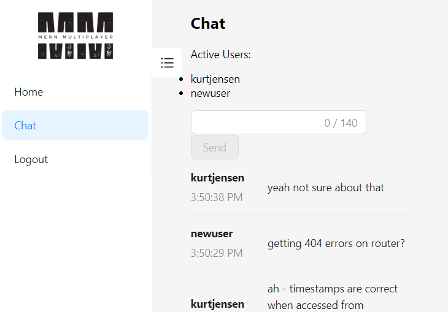

# MERN Multiplayer

  

  ## Description

  A multiplayer game platform built with a MERN stack - MongoDB/Mongoose, Express, React, Node.js - and GraphQL api with subscriptions over a websocket connection to facilitate real-time game state updates. Uses Ant Design for styling.

  Currently, real-time chat functionality is deployed. Games to come!

### Deployed Screenshot

  ### Deployed Link

Deployed at: [https://fast-ocean-08545.herokuapp.com/](https://fast-ocean-08545.herokuapp.com/)

  ## Table of Contents

  - [Installation](#installation)
  - [Usage](#usage)
  - [Contributing](#contributing)
  - [Credits](#credits)
  - [License](#license)
  - [Questions](#questions)

  ## Installation

  Run `npm run install` in the root directory.

  ## Usage

  Run `npm run develop` in order to launch server and react client concurrently.

  ## Contributing

    I welcome contributors interested in developing a real-time multiplayer game using graphQL subscriptions! PR at will.

  ## Credits

  University of Richmond Coding Bootcamp

  ## License
    
    This project is licensed under the MIT license.

  ## Questions

  - [GitHub User: Kurtmj93](https://github.com/Kurtmj93/)
  - Email: kurtmj93@gmail.com
